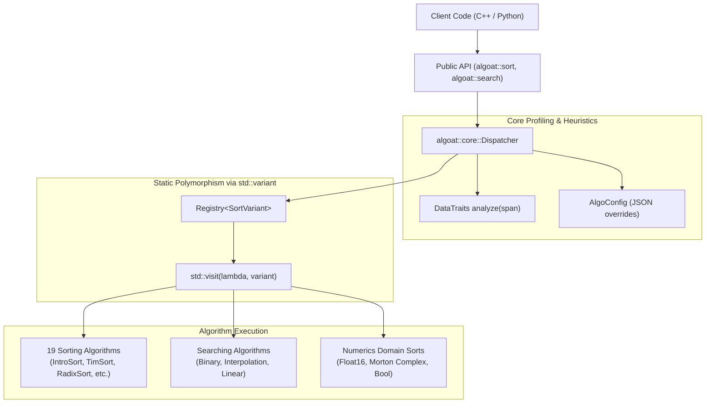
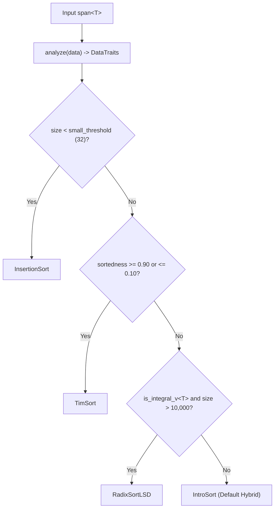

# Algoat: Architecture & Contributor Guide

Welcome to the internal architectural documentation for **Algoat**. This guide is designed to help developers and open-source contributors understand the internal design patterns, data flow, domain-specific algorithms, and contribution workflows of the library.

---

## 1. High-Level Architecture Overview

Algoat is built on a **Registry + Dispatcher** architecture that avoids virtual method table (`vtable`) overhead by leveraging C++20 concepts, `std::variant`, and `std::visit`.



---

## 2. Core Engine Components

### 2.1 Data Profiling (`algoat::core::DataTraits`)
Located in [`include/algoat/core/traits.hpp`](include/algoat/core/traits.hpp).

Before dispatching to a sorting or searching algorithm, Algoat performs a single $O(N)$ pass over the input data using `algoat::core::analyze(data)`. This calculates:
- **`size`**: Number of elements.
- **`sortedness_ratio`**: Computed as $\frac{\text{count}(data[i-1] \le data[i])}{N - 1}$. A ratio of `1.0` means fully sorted in ascending order; `<= 0.10` indicates reverse-sorted data.
- **`has_duplicates`**: Boolean indicating whether any adjacent duplicate elements were detected.

### 2.2 Algorithm Registry (`algoat::core::Registry`)
Located in [`include/algoat/core/registry.hpp`](include/algoat/core/registry.hpp).

The `Registry<VariantType>` class stores string-to-factory mappings (`std::function<VariantType()>`).
- Avoids dynamic casting and class inheritance hierarchies.
- Enables string-based algorithm lookup with compile-time type safety.
- Instantiates algorithm structs stored directly in a `std::variant`.

### 2.3 Heuristic Dispatcher (`algoat::core::Dispatcher`)
Located in [`include/algoat/core/dispatcher.hpp`](include/algoat/core/dispatcher.hpp) and [`src/core/dispatcher.cpp`](src/core/dispatcher.cpp).

When `algoat::sort(span)` or `algoat::search(span, target)` is called with `"auto"` configuration (the default), the dispatcher executes this decision tree:



---

## 3. Domain-Specific Numerics & Hardware Acceleration

Located in [`include/algoat/numerics/`](include/algoat/numerics/).

### 3.1 Float16 Bit-Flip Sort (`float16_sort.hpp`)
Standard floating-point comparisons involve costly floating-point comparison instructions and branch mispredictions. Algoat transforms IEEE-754 16-bit floating-point values into order-preserving unsigned integers:
- **Negative floats** (`u & 0x8000 != 0`): Invert all bits (`~u`).
- **Positive floats** (`u & 0x8000 == 0`): Set sign bit (`u | 0x8000`).

This maps floating point numbers from $- \infty \dots +\infty$ into a strictly monotonic unsigned domain $[0\text{x}0000 \dots 0\text{xFFFF}]$. Large arrays ($\ge 65,536$ elements) are then sorted in a single $O(N)$ counting pass with $65,536$ buckets.

### 3.2 Complex Number Morton Z-Order Sort (`morton.hpp`)
Rather than sorting complex numbers along a single 1D axis (lexicographically by real then imaginary part), Algoat sorts complex numbers along the **2D Morton Z-Order Space-Filling Curve**.
- Interleaves bits of the 32-bit real coordinate with the 32-bit imaginary coordinate into a single 64-bit spatial key.
- Uses x86-64 BMI2 hardware acceleration (`_pdep_u64`) when available.
- Sorts 64-bit Morton keys with an ultra-fast 4-pass 16-bit Radix Sort.
- Preserves 2D spatial locality in cache for spatial indexing and nearest-neighbor applications.

---

## 4. How to Add a New Sorting Algorithm

To contribute a new sorting algorithm to Algoat, follow these 4 steps:

### Step 1: Implement the Header
Create `include/algoat/sorting/my_new_sort.hpp`. Your struct must satisfy the `algoat::sorting::SortAlgorithm` concept:

```cpp
#pragma once
#include <string_view>
#include <span>
#include <concepts>

namespace algoat::sorting {

struct MyNewSort {
    [[nodiscard]] constexpr std::string_view name() const noexcept {
        return "mynewsort";
    }

    [[nodiscard]] constexpr std::size_t preferred_min_size() const noexcept {
        return 0;
    }

    template<std::totally_ordered T>
    void sort(std::span<T> data) const {
        // Implement algorithm here...
    }
};

} // namespace algoat::sorting
```

### Step 2: Register in `SortVariant`
In [`include/algoat/sorting/sorting.hpp`](include/algoat/sorting/sorting.hpp):
1. `#include "algoat/sorting/my_new_sort.hpp"`
2. Add `MyNewSort` to the `SortVariant` type alias.

### Step 3: Register in Dispatcher
In [`src/core/dispatcher.cpp`](src/core/dispatcher.cpp):
1. `#include "algoat/sorting/my_new_sort.hpp"`
2. Add factory registration inside `Dispatcher::Dispatcher`:
   ```cpp
   sort_registry_.register_algo("mynewsort", []() -> sorting::SortVariant { 
       return sorting::MyNewSort{}; 
   });
   ```

### Step 4: Add Unit Tests
Add a test in [`tests/sorting/`](tests/sorting/):
```cpp
#include <gtest/gtest.h>
#include "algoat/sorting/my_new_sort.hpp"

TEST(MyNewSortTest, HandlesRandomVector) {
    std::vector<int> data = {9, 3, 1, 5, 2};
    algoat::sorting::MyNewSort{}.sort(std::span{data});
    EXPECT_TRUE(std::is_sorted(data.begin(), data.end()));
}
```

---

## 5. Python nanobind Interoperability

Located in [`python/`](python/).

- **Zero-Copy NumPy Views**: NumPy arrays are converted to C-contiguous `nb::ndarray` views and mapped directly to `std::span<T>`, executing pure C++ code without memory allocations.
- **GIL Management**: Python list sorting unboxes elements into C++ wrappers (`PyFloatWrapper`, `PyBigIntWrapper`, `PyStringWrapper`), releases the Python GIL (`nb::gil_scoped_release`), sorts using C++ algorithms, and reconstructs the Python list.
- **Rich Comparisons**: `PyGenericWrapper` uses `PyObject_RichCompareBool` with thread-safe GIL acquisition for arbitrary custom Python objects.

---

## 6. Build, Test, and Benchmark Workflows

### Building the C++ Library & Tests
```bash
# Configure with CMake Preset or manual flags
cmake -B build -DCMAKE_BUILD_TYPE=Release
cmake --build build -j$(nproc)

# Run GoogleTest suite
ctest --test-dir build --output-on-failure
```

### Building & Testing Python Bindings
```bash
# Rebuild and install editable nanobind C++ extension into active virtual environment
CXX=g++ CC=gcc pip install --no-build-isolation -e .

# Run pytest suite
pytest tests/python/
```

### Running Benchmarks
```bash
# C++ sorting benchmarks
./build/benchmarks/bench_sorting

# Python / NumPy speedup benchmarks
python benchmarks/bench_python.py
```
